# Image Segmentation

## Objectives
- Understand segmentation fundamentals and challenges  
- Apply segmentation techniques to different problems  
- Identify limitations of each technique  

---

## 1. What is Image Segmentation
- Segmentation = Extract something from image
- Divides an image into meaningful regions or objects (finding group of pixel)
- Accurate segmentation allows us to :
    - counting : number of each type of object
    - measuring : geometric properties, area, perimeter of objecs in the images
    - property study : intensity, texture
- Types:  
  - **Semantic segmentation:** classificatioin, dont care single object just the category.
    -  three cars are colored Blue, but dont know how many.
    -  The sky is colored Red.
  - **Instance segmentation:** focuses only on distinct objects it can count,ignores the background 
    -  Car1 is Blue. Car2 is Green. Car3 is Yellow. The sky is ignored.
  - **Panoptic segmentation:** combine both, backgrounds get categories, distinct objects get unique IDs.  
    -  Car1 is Blue. Car2 is Green. Car3 is Yellow. The sky is Red. 

---

## 2. Segmentation Properties
How does the computer know where a "cat" ends and the "sofa" begins? It looks at the Intensity Values.

2 Main properties of intensity values : 
- **Discontinuity (Separate):** separate based on abrupt intensity change (edges) 
  - Edge-based : Detecting edges that separate region from each other
- **Similarity (Group):** group similar pixels (intensity, color, texture) 
  - Thresholding : Using pixel intensity 
  - Region-based : Grouping similar pixels -> region growing/merge&split

---

## 3. Discontinuity-Based Methods

### Point & Line Detection
- Detect isolated points or lines using masks/kernel
- Masks detect horizontal, vertical, or diagonal lines : 
  - Point : Laplacian mask 

  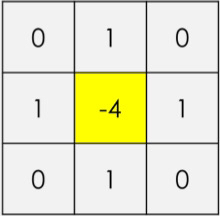 
  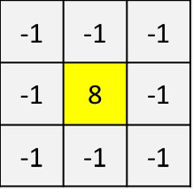

  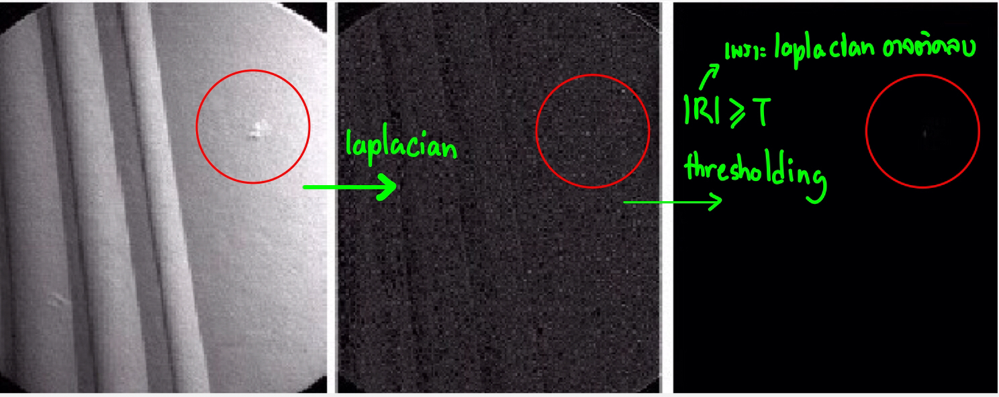
  - Line : Line mask

  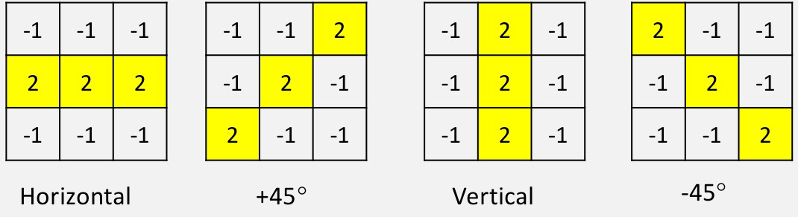

  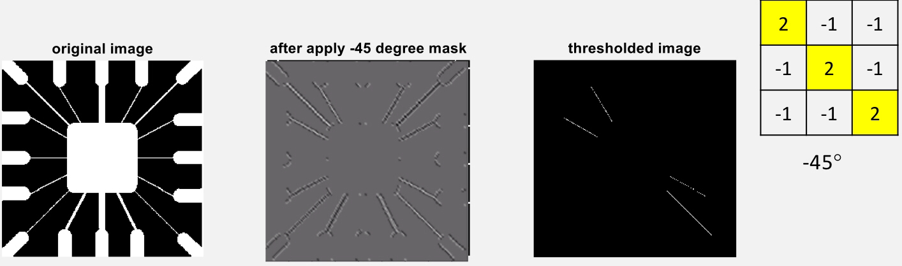
- **FYI** : Spatial and Convo filtering will give same result if mask is diagonally symmetric.

### Edge Detection
- Find boundaries between regions  
- **First Derivative (Gradient):** Robert/Sobel/Prewitt 
  - Apply these mark make normal picture -> Gradient Picture 
  - Prewitt is simpler, but Sobel have noise suppression because more weight on center
  - Each Pixel apply Gx get Rx and Gy get Ry, then $\sqrt{Rx^2 + Ry^2}$ 

  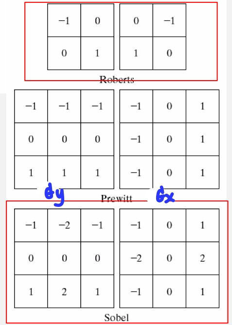

- **Canny Method (1986):** using 1st derivative, can detect thin line
  1. Gaussian smoothing : noise reduction
      - Apply 5x5 Gaussian Filter
  2. Compute gradient : Sobel 
      - Each Pixel apply Gx get Rx and Gy get Ry, then $R = \sqrt{Rx^2 + Ry^2}$
  3. Non-maximum suppression : make edge thinner
      - จาก edge หลาย pixel ให้เหลือแค่ 1 pixel, เอา pixel ที่ |R| สูงที่สุด 
  4. Hysteresis thresholding → connect real edges, 2 steps  
      1. แบ่งประเภท : Double Thresholding (มี 2 thresholds) pixel-wise
          - Strong Edge:  > MaxVal -> เก็บไว้เพราะใช่แน่
          - Weak Edge : MinVal < ค่าความเข้ม < MaxVal -> ไม่แน่ใจ -> เข้าขั้นต่อไป
          - Non-Edge : ค่าความเข้ม < MinVal -> ทิ้งไปเพราะไม่ใช่แน่
      2. Edge tracking : only Weak edge that connect with strong edge will remain
          - Weak edge ที่เชื่อมกับ Strong edge ผ่าน else ไม่ผ่าน

- **Second Derivative:** 
  - LoG = Laplacian(Gaussian Blur), cuz normal Laplacian too sensitive
  
    
  - LoG -> Thresholding -> Zero Crossing

  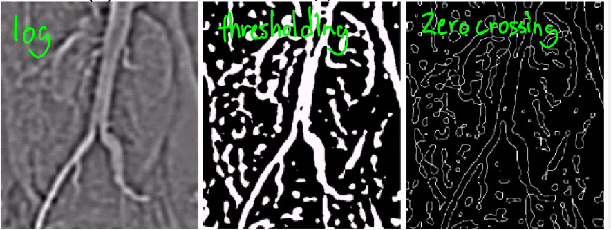

---

## 4. Hough Transform
Detect geometric shapes (curve line) from edge points.
  - Find every possible line that fit a set of pixels in an image.
  - each pixel can have 180 line create hough line, combined hough line of entire picture will show position of point that intersect most -> then we got a line 
### Line Detection
- Line equation: p = xcosθ + ysinθ  
- Uses accumulator to detect peaks  

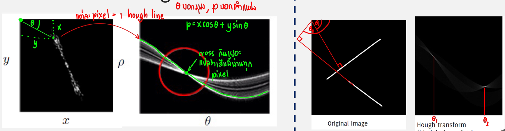

### Circle Detection
- Parameters: x₀, y₀, r  
- Used also for ellipse, parabola detection  

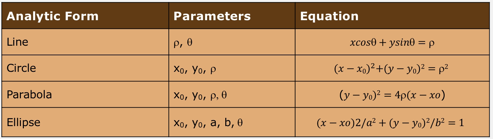

**Applications:** lane detection, shape recognition  

---

## 5. Similarity-Based Methods

### Thresholding
Separate object and background by intensity.
- The problem is how to choose threshold.
    - Too low -> reduce object size
    - Too high -> include extraneous background
  
  So we need automatic method for choosing Threshold -> Otsu's Method

#### Types
- **Global threshold:** one Threshold for all pixels  
- **Local threshold:** divide image into non-overlapping sections, each section got fix threshold  
- **Adaptive threshold:** For each pixel, the threshold is computed from its local neighborhood (sliding window).  

#### Otsu’s Method
- Automatic threshold from histogram (probability distribution)  
- Step through every possible K, each step calculate variance of 2 groups (group#1 = 0 to k, group#2 = k+1 to max-intensity)
- Maximizes between-class variance 

  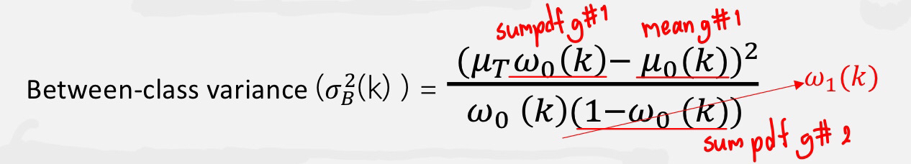

---

## 6. Region-Based Segmentation

### Region Growing / Watershed
- Pixels grouped based on similarity  
- Watershed treats image as landscape:  
  - Catchment basins = valleys, region  
  - Watershed lines = boundaries, edge  
- Marker-controlled version prevents over-segmentation  

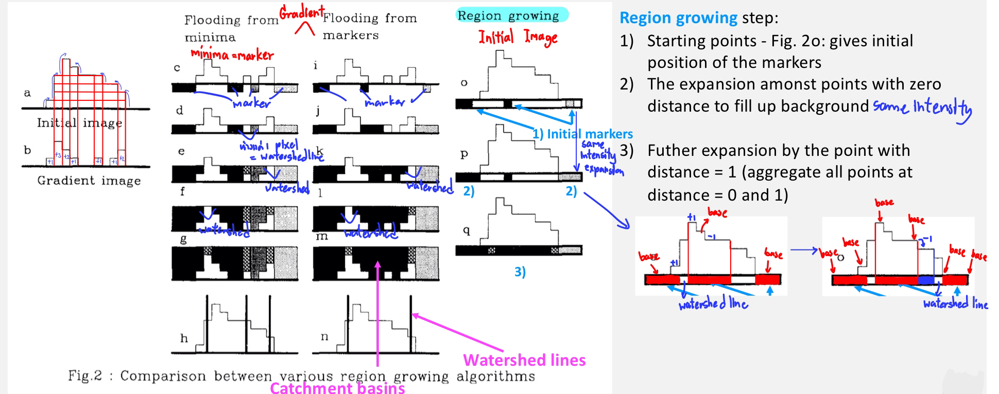

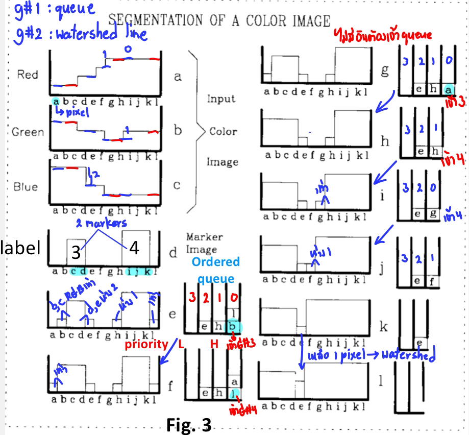

**Applications:** roads, object separation, fracture detection  

### Region Splitting & Merging
- **Splitting:** divide large region until homogeneous  
- **Merging:** combine adjacent similar regions   

