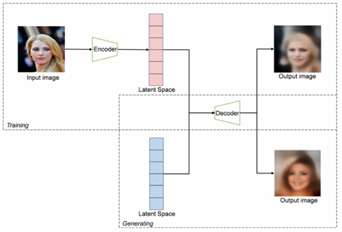
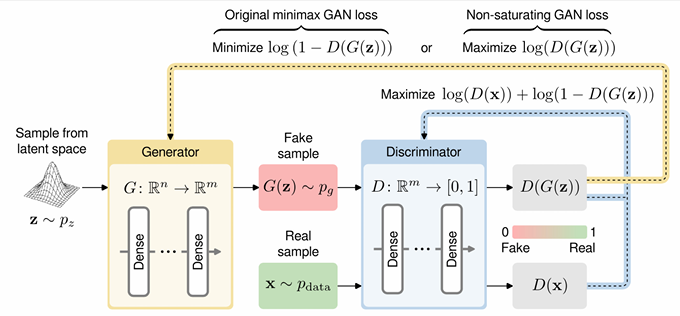
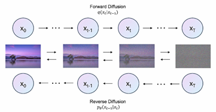
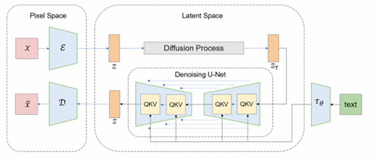

# Generative Models for Images

## ภาพรวมสาย Image Generation

สามตระกูลหลักของ deep generative model

- **VAE (Variational Autoencoder)** – 2013  
  encoder–decoder + probabilistic latent space
- **GAN (Generative Adversarial Network)** – 2014  
  generator vs discriminator เล่นเกมกัน
  - PixToPix (2017)
  - Style GAN (2018)
- **Diffusion Models** – 2020–now  
  ค่อย ๆ เติม noise แล้วค่อย ๆ ล้างออก

ตอนนี้ “diffusion” เป็นตัวหลักของ text-to-image รุ่นใหม่ ๆ (DALL·E 2, Midjourney, Sora ฯลฯ)

---

## VAE

โครงสร้าง: encoder–decoder เหมือน autoencoder แต่เป็นแบบ probabilistic
- Encoder:
  - มองภาพต้นฉบับ (x) แล้วแปลงเป็น "คำอธิบาย" z 
    - ความพิเศษของ VAE: แทนที่จะบอกเป๊ะๆ ว่า "ตาสีฟ้า, จมูกยาว 3 ซม." (ซึ่งคือ Autoencoder ธรรมดา) เขาจะบอกเป็น "ช่วงความน่าจะเป็น" Gaussian: μ(x), log σ²(x) เช่น "ตาน่าจะสีฟ้านะ, จมูกยาวประมาณ 2-4 ซม."  
  - นิยาม q(z|x) = N(μ(x), σ²(x) I), z ที่เกิดจาก x จะอยู่ในช่วง q
  - ใช้ reparameterization trick: z = μ + σ ⊙ ε, ε ~ N(0, I), สุ่มแค่ ε เพื่อให้สามารถคำนวณย้อนกลับตอน training
- Decoder:
  - รับ "คำอธิบาย" z แล้วพยายามวาดภาพออกมาใหม่ ($\hat{y}$) ให้เหมือนต้นฉบับ x ที่สุด

### Loss

- Reconstruction loss: วัดความต่างระหว่าง x กับ ŷ (เช่น MSE, L1, บางงานใช้ SSIM)
- KL divergence: D_KL(q(z|x), N(0, I)) เพื่อบังคับให้ latent ใกล้ Gaussian prior

รวม ๆ:   L = ReconLoss(x, ŷ) + KL(q(z|x) || N(0, I))

### การ generate ภาพ

- ตอน generate ไม่ต้องมีภาพ x
- สุ่ม z จาก prior ~ N(0, I) แล้วส่งเข้า Decoder → ได้ภาพใหม่ที่สมเหตุสมผลใน data manifold

**ปรับปรุงที่เจอบ่อย**

- **CVAE (Conditional VAE)**  
  ใส่ condition y (เช่น class, text) เข้าที่ encoder + decoder  
  → คุมได้ว่าอยากให้ generate class ไหน / ตาม text อะไร, จาก VAE ที่สุ่มได้อย่างเดียว
- **alignDRAW**  
  1st modern text-to-image model, ใช้ recurrent VAE + attention กับ text sequence as input
- **IntroVAE**  
  Self-evaluate the quality of generated samples and subsequently  self-improve (similar to GAN)

---

## GAN 

### Concept

มีสอง network เล่นเกมกัน:

- **Generator G(z)** – Decoder, รับ noise z (Gaussian Space) → สร้างภาพปลอม, คล้าย VAE
- **Discriminator D(x)** – Encoder, ดูว่าภาพเป็น real(จาก data) หรือ fake(จาก G), classification model

### Training
เกม min–max:
- เมื่อ 0 = fake, 1 = real
- D พยายามแยก real/fake → maximize log D(real) + log(1−D(fake))
- G พยายามหลอก D → minimize log(1−D(fake)) หรือ maximize log D(fake), recommend maximize log D(fake) เพราะไม่งั้น D กับ G จะมีจุดประสงค์ชนกัน

D(x) ใช้ loss ส่วนใหญ่เป็น **binary cross-entropy**

### ใช้ทำอะไร
- ส่วนใหญ่ใช้ Conditional GAN ทำ
- สร้าง “สิ่งที่ไม่เคยมีอยู่จริง”
  - face synthesis, style transfer, image-to-image, inpainting
  - restoration, super-resolution ฯลฯ
- **Data augmentation** 
  - Create Dataset

สไลด์มีตัวอย่าง:
- ซ่อมรูปเก่า
- เปลี่ยนสภาพอากาศ, เปลี่ยน style ภาพ landscape
- เปลี่ยน resolution, inpainting รูปที่ขาดหาย

---

## DCGAN (Deep Convolution GAN)
ก็แค่เปลี่ยนให้ model ใช้ Convolution แทน

### Generator

- Input: noise z (เช่น ขนาด 128)
- Stack ของ:
  - `ConvTranspose2d` (upsample)
  - `BatchNorm2d`
  - `ReLU`
- ค่อย ๆ ขยาย spatial size: 1×1 → 4×4 → 8×8 → … → 64×64
- เลเยอร์สุดท้ายใช้ **Tanh** → output อยู่ในช่วง [-1, 1]

### Discriminator

- Input: ภาพ `in_ch × 64 × 64`
- Stack ของ:
  - `Conv2d` (downsample)
  - `BatchNorm2d`
  - `LeakyReLU`
- ค่อย ๆ ลด spatial size, เพิ่ม channels
- เลเยอร์สุดท้ายให้ scalar probability ผ่าน Sigmoid

### Training loop (โดยย่อ)
Train สลับ D -> G -> D
1. อัปเดต D:
    - ใช้ real images (label=1) → loss_real
    - ใช้ fake จาก G(z) (label=0) → loss_fake
    - รวมเป็น `errD` → backward + `optimizerD.step()`
2. อัปเดต G:
    - สร้าง fake ใหม่จาก noise
    - ป้อนเข้า D แต่ใช้ label=1 (อยากให้ D คิดว่าเป็น real)
    - ได้ `errG` → backward + `optimizerG.step()`

---

## Evolution & Variants ของ GAN

### ProGAN – Progressive Growing

- Train จากภาพ **ความละเอียดต่ำ → สูงทีละขั้น**
  - เริ่มที่ 4×4 → ค่อยเพิ่มเลเยอร์จนถึง 1024×1024
- Stable ขึ้นในการ train รูปใหญ่ ๆ

### CGAN – Conditional GAN

- เพิ่ม condition y เข้า G และ D (เช่น class label, text, image อื่น)
- ทำให้ควบคุมสิ่งที่ generate ได้ เช่น “แมว”, “หมา”, “รองเท้า”

### Pix2Pix – Image-to-Image Translation
- xA (input image), xB (Original, Expected Result), G(xA) : predicted image

- ใช้ **PatchGAN discriminator**:
  - D ให้ D(xA,G(xA)) สำหรับ Generator, D(xA,xB) สำหรับ improve discriminator
  - PatchGAN มีการแยกเป็นส่วนๆ ทำให้รู้ว่าส่วนไหนดู real/fake แค่ไหน 
- Loss for Generator = **GAN loss + λ · ||xB - G(xA)||**:
  - GAN loss: ให้ภาพดู real

---

## ข้อจำกัดของ GAN

- **Mode collapse**  
  G สร้างรูปแค่บางแบบ ไม่ครอบคลุมความหลากหลายของ data
- **Unstable training**  
  ถ้า D แรงเกิน G หรือ learning rate เละ → gradient หาย / แกว่ง
- ยากในการ model distribution ที่หลากหลายมาก ๆ แบบครบทุก mode

ปัญหาเหล่านี้เป็นหนึ่งในเหตุผลที่คนเริ่ม shift ไปทาง diffusion models

---

## Diffusion Models – DDPM

### Concept หลัก
- เป็น Parametric Markov Chain -> Iterative Process

มีสองขั้นตอน:

1. **Forward (noising) process**
    - เริ่มจากภาพจริง \(x_0\)
    - ค่อย ๆ เติม Gaussian noise ได้ \(x_1, x_2, ..., x_T\)
    - สุดท้าย \(x_T\) จะกลายเป็น noise เกือบสมบูรณ์แบบ (high entropy)
    $$x_n = x_{n-1} + ε_{n-1}$$
2. **Reverse (denoising) process**
    - เริ่มจาก noise \(x_T\)
    - ค่อย ๆ ใช้ model (เช่น U-Net) ทำนาย
    $$x_{n-1} = x_n - ε_{n-1}$$
    - U-Net ใช้ $x_n$ มาทำนาย $ε_{n-1}$ แล้วลบมันออก
    - ใช้ **MSE loss** ระหว่าง real_noise vs pred_noise -> ทำ improve ความสามารถในการ predict noise จาก x_n
    - ไปจนถึง \(x_0\) → เป็นภาพใหม่ที่ sample มาจาก data distribution

---

## Latent Diffusion & Stable Diffusion

**Stable Diffusion** ใช้ไอเดีย **Latent Diffusion Model (LDM)**:
- **Key Concept : เพิ่ม noise ใน latent**

Step : 
- ใช้ encoder บีบภาพให้เป็น latent z
- ทำ diffusion ใน latent space แทน pixel space
  - ลดความซับซ้อน, ประหยัด compute
- ใช้ U-Net เป็น core denoiser : เหมือนเดิม
  - ใส่ text condition ผ่าน text encoder (เช่น Transformer) + cross-attention
- ได้ latent จาก U-net ผ่าน decoder -> เป็นภาพ

---

## Diffusion vs GAN

- **Diffusion models**
  - Train เสถียรกว่า GAN มาก
  - ไม่ค่อยเจอ mode collapse
  - Flexible: ใช้กับภาพ, เสียง, วิดีโอ, 3D ฯลฯ
  - แต่ sampling ช้า (ต้องหลาย step)
- **GAN**
  - Sampling เร็วมาก (แค่ forward ทีเดียว)
  - แต่ train ยาก, ปัญหา mode collapse/unstable เยอะ

แนววิจัยใหม่ ๆ เลยพยายาม:
- ทำ diffusion ให้ “few-step / one-step” เข้าใกล้ความเร็ว GAN
- หรือ hybrid แนว diffusion+GAN

---

## Ethics & Social Impact

- **Deepfakes & misinformation** – ปลอมหน้า/เสียง/วิดีโอได้เหมือนมาก
- **Consent & privacy** – ใช้หน้าคน/รูปคนโดยไม่ขออนุญาต
- **Bias & discrimination** – ถ้า data ลำเอียง output ก็ลำเอียงตาม
- **Art & IP** – ปัญหาเรื่อง style ของศิลปิน, ลิขสิทธิ์, creative ownership
- **Economic impact** – กระทบงานสาย creative บางส่วน แต่ก็เปิดโอกาสงานใหม่ในอีกด้าน

